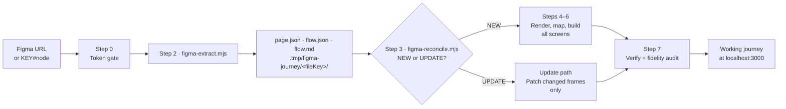
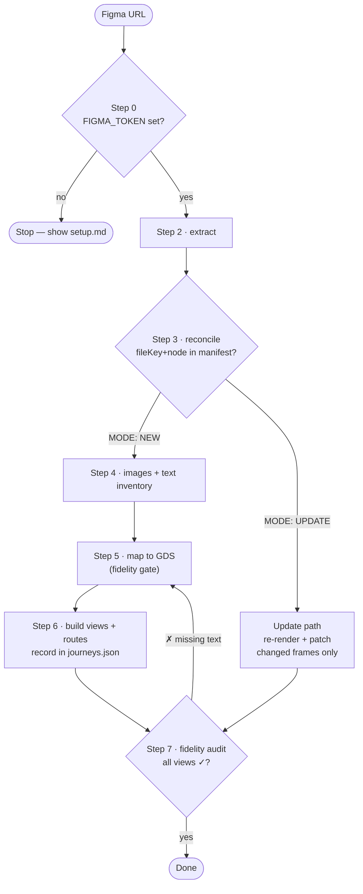
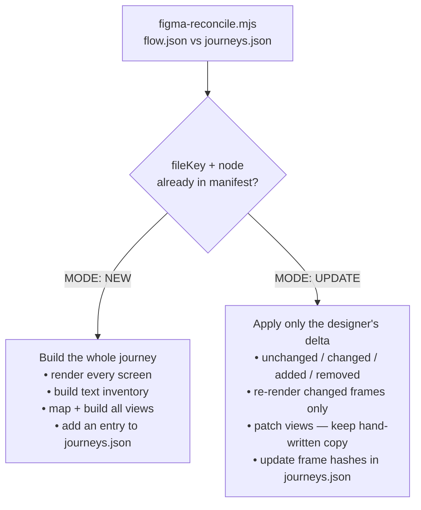
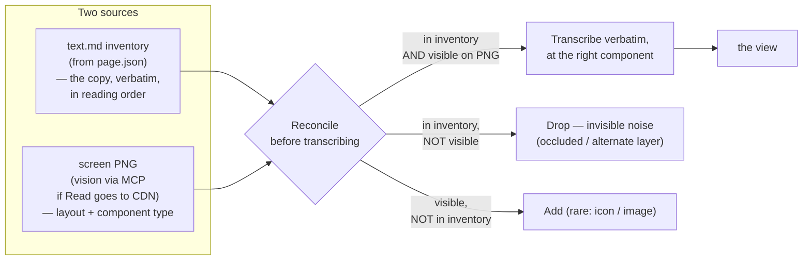
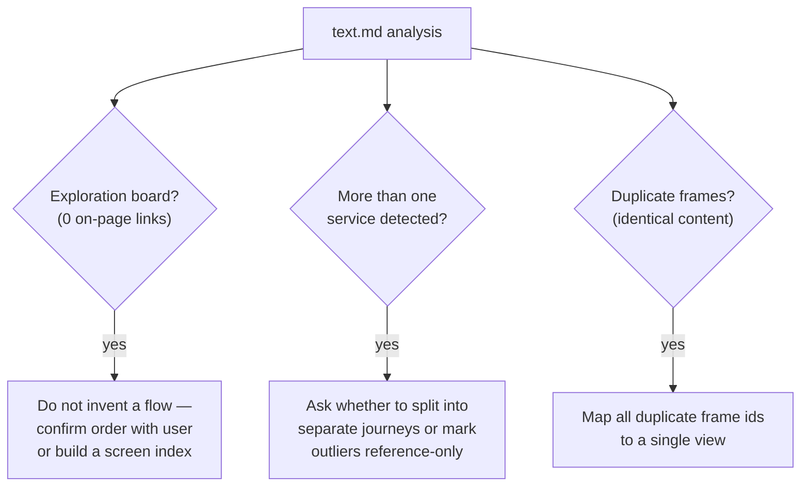

# Figma journey skill

The `/figma-journey` skill turns a clickable **Figma** prototype into a working **GOV.UK Prototype Kit**
journey in this repo — and can update one that has already been built when the designer changes the Figma.

It talks to the **Figma REST API directly** (no Figma MCP), pulls the page's screen frames and the wired
click-flow, renders a PNG per screen, and reconciles everything against a manifest of journeys it has
already built. It then maps each screen to GOV.UK Design System components and scaffolds (or surgically
patches) the views and routes so the flow actually clicks through at `http://localhost:3000`.

> **Where it lives:** `.ai/commands/figma-journey/` (symlinked from `.claude/commands/`).
> The instructions are in `SKILL.md`; the helper scripts are in `scripts/`.

---

## End-to-end pipeline

The extract step pulls from Figma **once** and caches the raw node tree (`page.json`), the machine-readable
flow (`flow.json`) and a human-readable map (`flow.md`). Every later step reads that cache rather than
re-fetching, so a run only hits the Figma API once.

---

## The eight steps

| Step                     | Script / command                     | What it does                                                         | Decides / produces                           |
| ------------------------ | ------------------------------------ | -------------------------------------------------------------------- | -------------------------------------------- |
| **0 — Token gate**       | `curl … /v1/me`                      | Confirms a read-only `FIGMA_TOKEN` is present and valid              | Stops if missing/expired                     |
| **1 — Parse location**   | _(built into the scripts)_           | Derives `fileKey` + `nodeId` from any Figma URL form                 | Normalises `1234-56` → `1234:56`             |
| **2 — Extract**          | `figma-extract.mjs`                  | Pulls frames, transitions, per-frame fingerprint                     | `page.json`, `flow.json`, `flow.md`          |
| **3 — Reconcile**        | `figma-reconcile.mjs`                | Compares fresh frames against `journeys.json`                        | `MODE: NEW` or `MODE: UPDATE`                |
| **4 — Render + capture** | `figma-images.mjs`, `figma-text.mjs` | PNG per screen **and** a verbatim text inventory per screen          | `screen-*.png`, `text.json`, `text.md`       |
| **5 — Map to GDS**       | _(manual, using `gds-mapping.md`)_   | Maps each screen to stock `govuk-frontend` components                | Per-screen fidelity gate                     |
| **6 — Reconstruct**      | _(writes views + routes)_            | Builds one auto-served view per screen; branching in `app/routes.js` | `app/views/<journey>/*.html`, manifest entry |
| **7 — Verify**           | `npm run dev`, `figma-fidelity.mjs`  | Click-through + content audit vs the Figma                           | Pass/fail per view                           |

---

## How a run branches

Two loops to notice:

- **Step 7 → Step 5** when the fidelity audit finds screen copy present in Figma but missing from a built
  view — fix the view and re-run until every view is `✓`.
- The **UPDATE** branch skips the full build and patches only the frames the designer changed.

---

## NEW vs UPDATE

The manifest (`.ai/commands/figma-journey/journeys.json`) records every journey the skill has built — the
Figma `fileKey` + `node`, the journey key, and a content fingerprint of each frame. Step 3 decides which
path to take:

The fingerprint ignores a frame's position on the canvas, so simply moving a screen is not treated as a
change — only changed text, structure or prototype wiring is.

---

## How accuracy is kept: two sources, reconciled

This is the core mechanism that prevents the classic "missing text" / "wrong component" errors. Neither
source is enough on its own:

- The **text inventory** (`figma-text.mjs`) is the authoritative list of _what_ copy is on each screen and
  _in what order_ — pruned of hidden/opacity-0 subtrees and the repeated header/footer chrome.
- The **PNG** (read directly, or via a vision MCP tool when `Read` hands the image to a CDN) tells you
  _how_ it is laid out and _which component_ each string is.
- **Step 7's fidelity audit** (`figma-fidelity.mjs`) checks this mechanically: it fetches each rendered
  view and confirms every content string from the inventory is actually present.

---

## Board checks the skill performs

`figma-text.mjs` analyses the whole frame set and flags three situations that change how you build. Act on
these _before_ writing any views:

---

## Scripts

| Script                | Purpose                                            | Reads                                    | Writes                              |
| --------------------- | -------------------------------------------------- | ---------------------------------------- | ----------------------------------- |
| `figma-extract.mjs`   | Pull frames + click-flow from Figma                | Figma API                                | `page.json`, `flow.json`, `flow.md` |
| `figma-reconcile.mjs` | NEW vs UPDATE, and the per-frame change report     | `flow.json`, `journeys.json`             | _(prints)_                          |
| `figma-images.mjs`    | Render one PNG per frame                           | `flow.json`/`page.json`, Figma API       | `screen-*.png`                      |
| `figma-text.mjs`      | Per-frame verbatim text inventory + board analysis | `page.json`, `flow.json`                 | `text.json`, `text.md`              |
| `figma-fidelity.mjs`  | Post-build content audit                           | `text.json`, `journeys.json`, dev server | _(prints ✓/✗ per view)_             |

All scripts are dependency-free (Node 22 global `fetch`), take the Figma URL or `KEY#node` as their
argument, and never print the `FIGMA_TOKEN`.

---

## Files produced by a run

| Path                                        | Produced by | Purpose                                        |
| ------------------------------------------- | ----------- | ---------------------------------------------- |
| `.tmp/figma-journey/<fileKey>/page.json`    | extract     | Raw Figma node tree (source of truth for text) |
| `.tmp/figma-journey/<fileKey>/flow.json`    | extract     | Machine-readable frames + transitions + hashes |
| `.tmp/figma-journey/<fileKey>/flow.md`      | extract     | Human-readable map of screens + click-flow     |
| `.tmp/figma-journey/<fileKey>/screen-*.png` | images      | One rendered PNG per screen                    |
| `.tmp/figma-journey/<fileKey>/text.json`    | text        | Per-frame content inventory (machine-readable) |
| `.tmp/figma-journey/<fileKey>/text.md`      | text        | Per-frame content inventory (human-readable)   |
| `app/views/<journey>/*.html`                | Step 6      | One auto-served view per screen                |
| `app/routes.js`                             | Step 6      | Branching/validation handlers only             |
| `.ai/commands/figma-journey/journeys.json`  | Step 6.6    | Manifest so future runs reconcile correctly    |

`.tmp/` is gitignored working state; the committed outputs are the views, the routes and the manifest.
